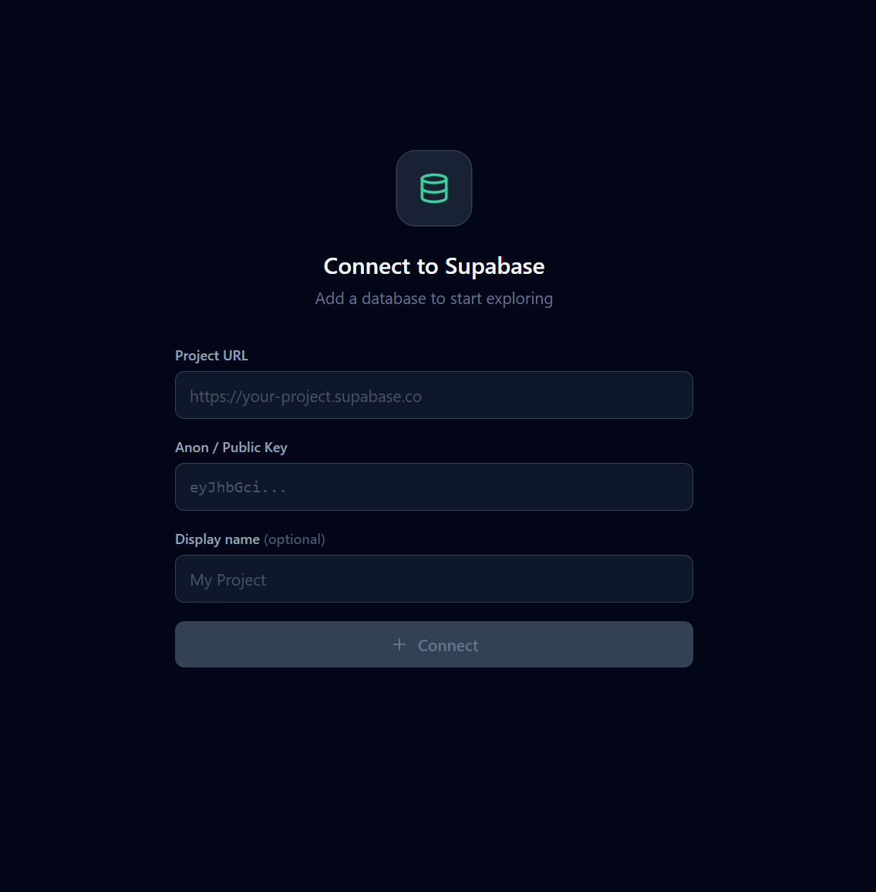
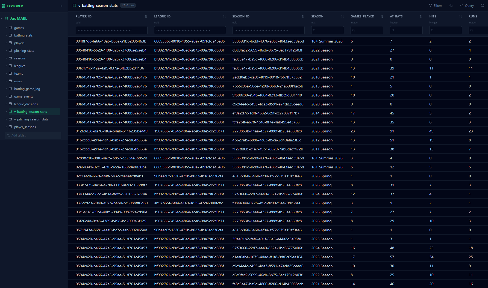
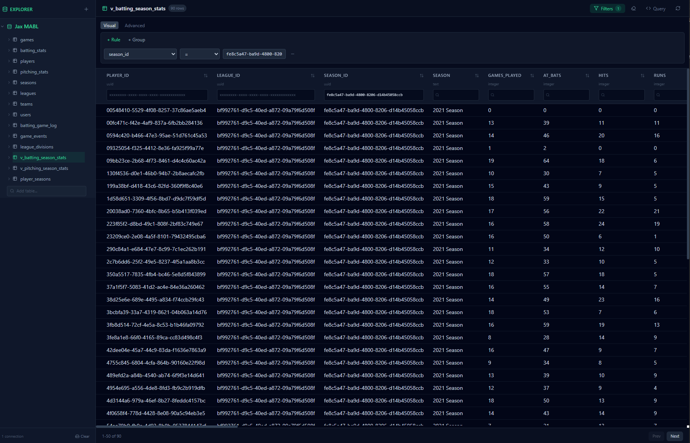
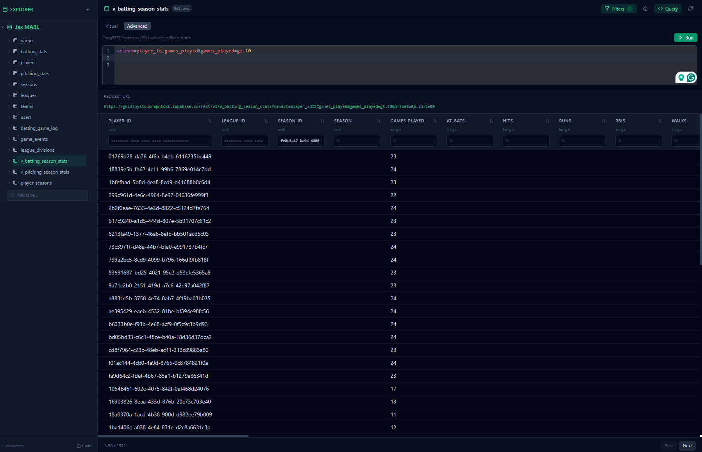

# Supabase IDE

[](https://bolt.new/~/sb1-rdx5q3en)

Supabase IDE is a browser-based explorer for querying Supabase tables when you have a project URL and anon/public API key. It is designed for local, personal configuration: connections, table names, and active selections are saved in browser localStorage.

## Screenshots

### Connection Setup



### Table Browser



### Visual Filters



### Advanced Query



## Features

- Configure one or more Supabase projects.
- Validate and save manually entered table names per connection.
- Browse discovered table columns and normalized column types from the sidebar.
- Remove saved table names from the UI without deleting database tables.
- Query selected tables with a visual rule builder.
- Sort and filter from table column headers.
- Preserve filters and ordering independently for each saved table.
- Clear current-table filters quickly.
- Clear local browser data by category.
- Use an advanced query editor for explicit raw query submissions.
- Preview the generated PostgREST request URL.
- Deploy as a static app through GitHub Pages.

## Getting Started

Install dependencies:

```bash
npm ci
```

Run the development server:

```bash
npm run dev
```

Build for production:

```bash
npm run build
```

Preview the production build:

```bash
npm run preview
```

## Project Checks

```bash
npm run typecheck
npm run lint
npm run test
npm run build
```

## GitHub Pages

The repository includes a GitHub Pages workflow in `.github/workflows/deploy.yml`. Pushes to `main` build the Vite app and deploy the `dist` artifact through GitHub Pages.

The Vite config uses `base: './'` so assets resolve correctly from a GitHub Pages URL.

## Privacy And Security

Connection settings are stored in your browser localStorage. This includes Supabase URLs and API keys. Use anon/public keys intended for client-side use, and rely on Supabase Row Level Security policies to control what data is visible.

This app is a client-side explorer. It does not store configuration on a server, and removing saved table names or connections only changes local browser settings.

## Documentation

- [Architecture](ARCHITECTURE.md)
- [Documentation Timeline](docs/README.md)
- [Screenshot Gallery](docs/screenshots/README.md)
- [Current State Decision](docs/decisions/0001-2026-06-04-current-state.md)
